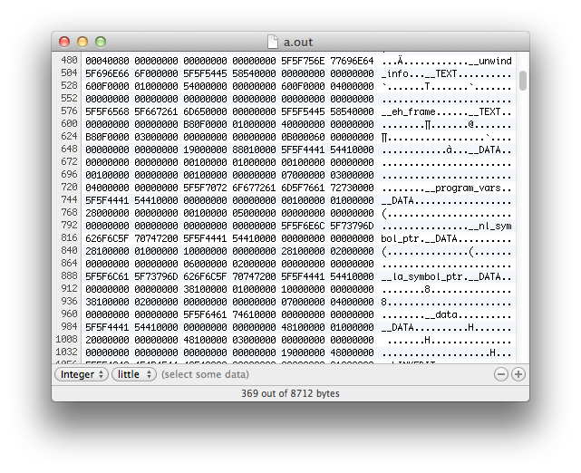

*What instructions do Computers understand?*

Computers do not *understand* anything. Computers are *unintelligent*! They are a machine that can respond to a set number of instructions. The set of instructions that a computer uses is its *instruction set* and contains instructions to perform basic mathematic operations, loading and storing data in memory, comparing numeric values, and jumping to instructions elsewhere in the program's code. These simple actions are performed very quickly and can be used to create everything you have ever seen a computer do.

The computer's instructions are hard-wired into the computer's processing hardware. The logical circuits within the computer can distinguish between two different electrical signals on each connection, with a negative charge representing "on" and positive for "off." For example, an 8-bit CPU (Central Processing Unit) has eight connections for each instruction it receives. In this context, each instruction is a combination of eight different *on/off* signals - giving 256 different combinations.

Designing a CPU involves determining the instructions that it will support. The designers map each instruction to a unique combination of signals. For example, `00000001` could be adding values together, `00000010` could be subtracting, `00000011` comparison, and so on. These combinations of signals are the codes used to operate the machine, the **machine code**.

Rather than thinking of these as *off/on* signals directly, we abstract these to numeric values: 0's and 1's, binary values. For example, the combination of "off,on,on,off,off,on,off,off" would be `00110100`. Each digit in this is called a **bit**, hence the term 8-bit computer. Each instruction is a combination of eight binary digits.

:::note

1. The **CPU** (Central Processing Unit) is the workhorse of the computer. It executes the program's instructions.
2. The set of instructions a CPU uses is called its **Instruction Set**. Different kinds of CPUs have different instruction sets.
3. Common instruction sets include ARM (mobiles, tablets, new Macs) and x86-64 (used in desktops and laptops).

:::

## Programming in Machine Code

Below is a section of the machine code for a small program. These 1s and 0s are the codes used to instruct the computer when this program run. You can write a program directly in machine code, but this is a time-consuming task and limited to only run on the one CPU architecture.

```hex
...
0110 0111 0111 0010 0000 0000 0110 0011 0100 1110 0101 1111 0100 0001 0101 1000
0110 0111 0111 0010 0000 0000 0111 0110 0101 1111 0101 1111 0110 1001 0101 1111
...
```

Working at this level of detail is a challenge, but fortunately, you do not need to. Software developers have created tools to help build programs without having to think about these low-level details. These tools make it possible to work at a **higher level of abstraction**. They take the code you write and do the hard work of converting that to the machine code of the computer you want to run it on.

:::note

1. With the right tools, you can look at the machine code of any program on your computer.
2. If you open the program in a text editor, it will look strange, not at all like a list of binary values. The text editor displays one character for every **8 bits** (1 byte) in the file. Interpreting this is challenging as you now have 256 different characters you need to be able to map to their binary value.
3. A **Hex Editor** is a program that is useful for examining binary data. It shows you one character for every **four bits** in the file, making it much easier to map between the character shown and its binary representation. In this format there is only 16 different characters you need to work with. The following table maps all 16 values, from the binary value 0000 being represented as 0 in hex to 1111 being F.

:::

| Binary | Hex   | Binary | Hex   | Binary | Hex   | Binary | Hex   |
|:------:|:-----:|:------:|:-----:|:------:|:-----:|:------:|:-----:|
| `0000` | 0 | `0001` | 1 | `0010` | 2 | `0011` | 3 |
| `0100` | 4 | `0101` | 5 | `0110` | 6 | `0111` | 7 |
| `1000` | 8 | `1001` | 9 | `1010` | A | `1011` | B |
| `1100` | C | `1101` | D | `1110` | E | `1111` | F |


