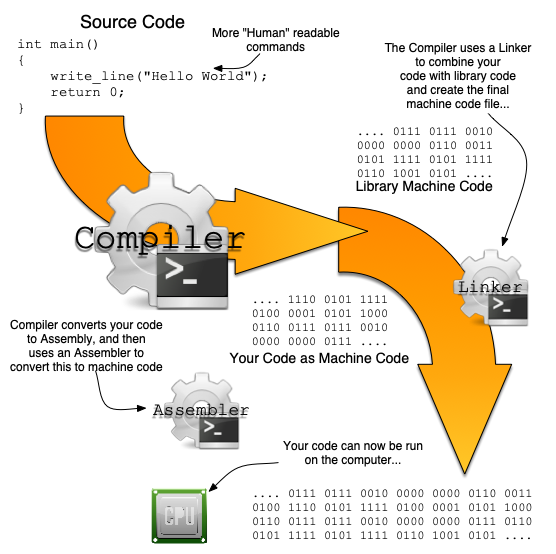

## Converting source code to machine code

There are two approaches to converting *source code* to *machine code*, involving two different kinds of programs: **compilers** and **interpreters**.

A **compiler** is a program that converts *source code* into *machine code* it saves to an **executable file** we think of as a program or "app." The executable file contains the machine code to be loaded into memory and started when the user runs that program. Programs created in this way run independently of their source code, meaning you can distribute them to users who can run them without needing additional resources. Compiled languages include C, C++, Go, Objective-C, Pascal, Rust, and Swift.

**Interpreters** work by reading the source code and performing the actions as it reads the code. Programs written in this way are distributed as their source code and require the user to have the interpreter to run the program. Interpreted languages include JavaScript, Python, R, Ruby, and sh. Using an interpreted language can usually simplify the distribution process as the interpreter can be customised for different environments.

Compiled languages have the following advantages and challenges:

- Execution does not require an interpreter:
  - It is easier for the user as they do not need to install the interpreter
  - Potentially faster, as instructions are directly run (no need to read and interpret what needs to happen)
- All of the code is checked when it is compiled. This allows some issues with the code to be quickly identified.
- Programs can be distributed independently of the code - meaning others cannot easily decode what is provided.
- Developers need to compile the program multiple times for different platforms (operating systems and different CPUs).
- Changes to the code need to be compiled before they can be tested - which can take some time for large programs.

Interpreted languages have the following advantages and challenges:

- Interpreters generally provide a good range of features, making it quick to develop programs.
- Many interpreted languages include environments called "REPLs" (Read Execute Print Loop) in which you can dynamically run instructions to test out ideas.
- You do not need to compile before you run changes to your code.
- However, there is also nothing checking that all of the code is valid. Small mistakes in the code may go undetected unless there is rigorous testing put in place.

Some languages use a combination of a compiler and an interpreter. In these cases the compiler will read the program source code and convert it to an intermediate **byte code** that is then run by the interpreter. This can help overcome some of the challenges of interpreted languages, as the whole program can be verified to be valid during compilation while the deployment gains the advantage of running within an interpreter. Languages that use this approach include C#, Java, and TypeScript.

## Working with a compiler

In this book, we will be using a compiled language, so let's look a little further at the details of how this works.

Internally, a compiler will perform several steps, as shown in the following image.

1. **Preprocessing**: The compiler reads the code and performs a first pass. The code is read from your source code files. This may involve some processing of the text itself, which includes things like ignoring any comments in the code.
1. **Compiling**: The code is converted to assembly instructions, and an assembly program is output.
1. **Assembling**: The assembly version of the program is converted into machine code, and stored in *object files*.
1. **Linking**: A *Linker* to combine together the machine code from your program with other machine code you have used from the programming libraries. This then outputs an executable program.