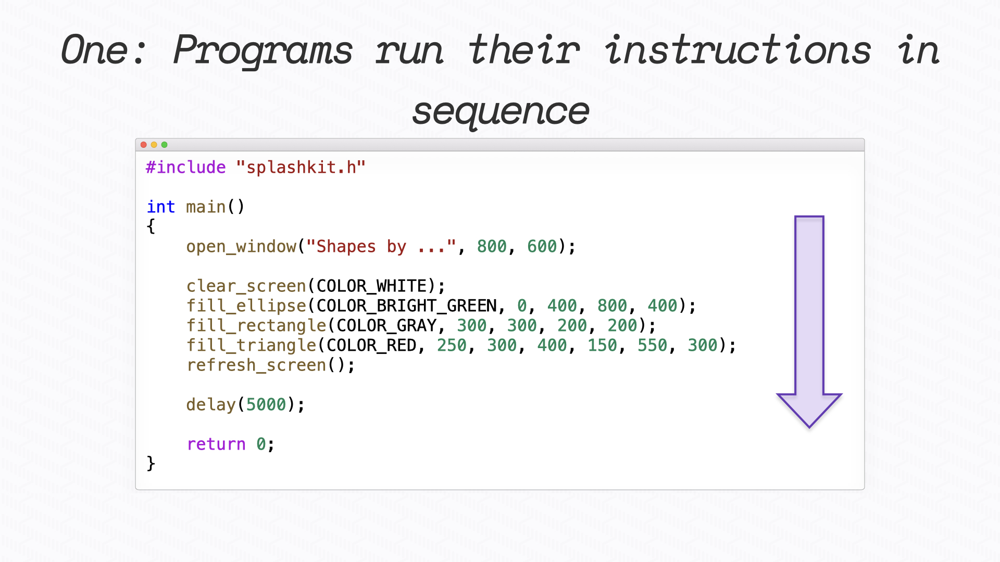
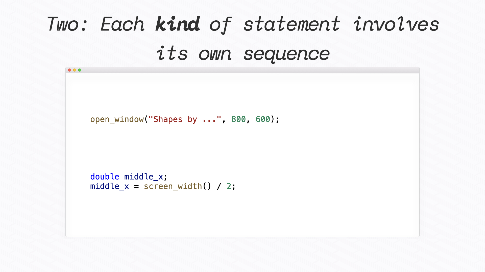
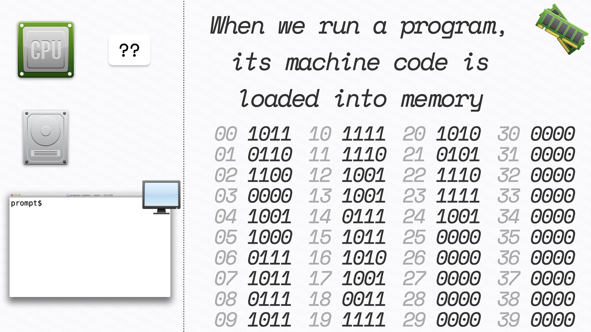
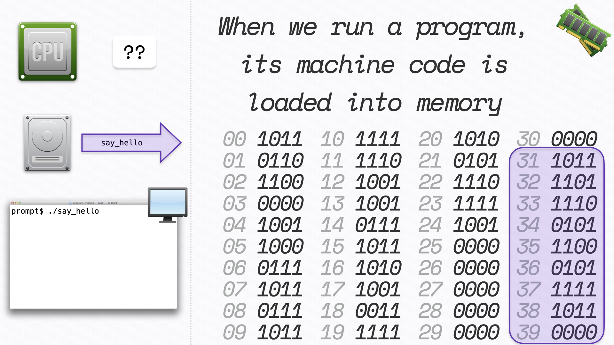
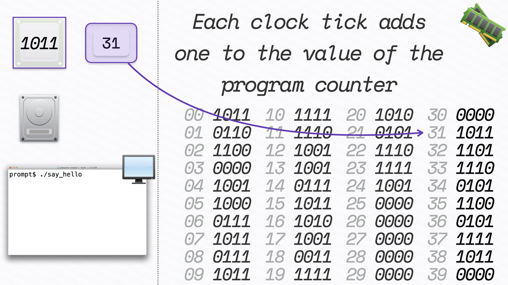
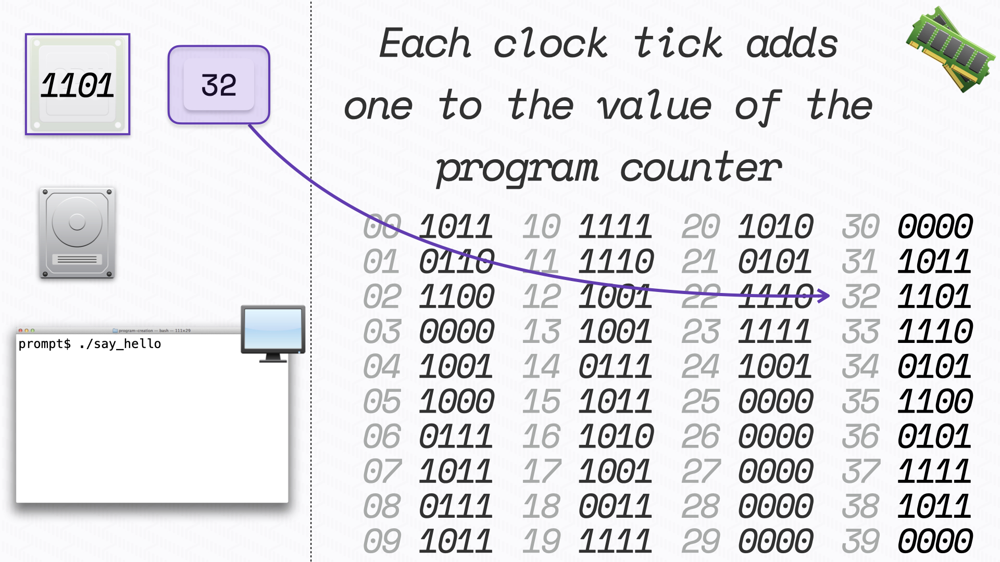

Computers operate by performing a **sequence** of actions determined by **instructions** that it loads from memory. When one instruction finishes, the computer reads the next instruction from memory and performs its action. This process repeats over and over as the computer runs.

## Sequence overview

There are two important things to take away from this simple concept:

1. Programs run their instructions in sequence.
2. Each kind of statement involves its own sequence.

### Programs run their instructions in sequence

Programs are a list of instructions (statements). When you run a program, it will execute its code one instruction at a time.

The following picture shows the code for a small program that draws some shapes to the screen.

When you run this program, it will:

1. Open a window
2. Clear that window to white
3. Draw a filled ellipse in bright green
4. Draw a filled rectangle in gray
5. Draw a filled triangle
6. Refresh what is on the screen in the window
7. Delay for 5 seconds (5000 milliseconds)
8. End

Running this program will show you the following picture. Drawing to a window in this way uses a **painter's model**, meaning that things will layer on top of each other. Shapes drawn first will appear in the background, with anything drawn later appearing on top. Notice that the rectangle appears on top of the green ellipse (which we can only see part of).

:::tip Think...

- What would happen if you:

  - reversed the order of the drawing instructions?
  - removed the delay from this program?
  - added more drawing instructions after the delay?

- Given the painter's model, is there a reusable sequence you can identify in this code?

:::

When designing programs, sequence will be essential to your approach. You need to be able to *sequence* the instructions you want the computer to execute in a way that gets the output you want. Remember, the computer is unintelligent. So your instructions need to be unambiguous, something a machine can perform.  Try to think through things slowly and carefully, in defined steps that run one after the other.

:::note

- Each programming language will have a set starting point. In the C/C++ language, this is `main`. When you run your program, your code will start with `main`.
- Semicolons (;) terminal each of your statements in C/C++ code. Each statement will run its steps before the computer moves to run the next statement.

:::

### Each kind of statement involves its own sequence

When you are programming, you are usually focusing on the sequence of the steps in your program. However, when learning to program, one of the key things to understand is that each statement in your code will become more than one machine code instruction for the computer to run. To understand how programs work, you need to understand the steps involved in each of the different kinds of statements in the programming language.

When you compile your code, the compiler reads the statements in your code and converts these to machine code. Each of the different statements has its own set of actions that it performs.

:::note

- Most programming languges support the same kinds of statements, which usually work in basically the same way.
- When learning a new kind of statement, focus on the sequence of actions it performs.
- Learn more about the low level details of how computers work when you study computer systems. [Elements of Computer Systems](https://www.nand2tetris.org) provides a great overview.

:::

## Sequence - How it works

The following details all work together to help set the scene for how sequence works:

- Each instruction in the computer is the same size. A 64bit computer has 64bit instructions.
- Values in memory are accessed in chunks of memory the same size as an instruction. So each 64bits is accessible at a unique address.
- You can think of memory as a long list of values. Each 64bit value has a unique index (its address).

Let's see how this works by stepping through a sample program on a 4bit computer.

1. Let's start with the state of the computer *before* the program is started.

   The main thing to notice at this stage is the organisation of memory. The grey numbers show the addresses, with each storing one 4bit value. For example, the value at address `14` is `0111`.

   

2. When the program starts, the operating system loads its instructions into memory. In this case, it is loaded at address **31**.

    

3. When the program is loaded, the **program counter** is assigned the address of the first instruction in memory.

    The program counter determines the instruction for the CPU to execute. In this case, the CPU runs the code `1011`.

    

4. After the instruction completes, the value in the program counter is increased by one.

    The program counter now refers to address `32`, and the CPU runs the code `1101`.

    

5. This process continues as the program runs.

:::tip think

The value in the program counter changes as the program runs. Programming languages take advantage of this capability to allow you to control the sequence of actions.

What would happen if the user of a program could, through specially crafted actions, change the value of the program counter? What would this enable them to do?

:::

## Sequence in other languages

In this book, we are learning to program using what is known as an **imperative** programming language. All imperative languages involve programs that tell the computer what to do. Languages such as Python, C#, Java, JavaScript, TypeScript, Go, Rust, and many more are imperative programming languages involving the programmer writing sequences of instructions.

**Declarative** languages are another class of programming language. When creating a declarative program, you declare what you want as output rather than coding the steps to achieve that output. These languages determine the sequence needed to get the results you requested. SQL, HTML, and CSS are some common declarative programming languages. With SQL, you write queries indicating the data you want to select from a database. HTML and CSS allow you to define the elements of a web page and how you want those elements styled. In these cases, the database or web browser interpret your requirements and sequence the instructions to produce the output you requested.

Declarative languages also include **functional programming** and **logic programming** languages. With functional programming, a program consists of nested functions that convert inputs into outputs. Lisp and Haskell are examples of functional programming languages. With logic programming, you create a database of *knowledge* made up of known facts. You can then query this database to determine the truth of given statements, and the language will use what it knows to determine (or infer) the truth of your statement.

Starting with an imperative language will help you better understand how the computer works. These languages put you in control of the *sequence* of instructions the computer runs.
